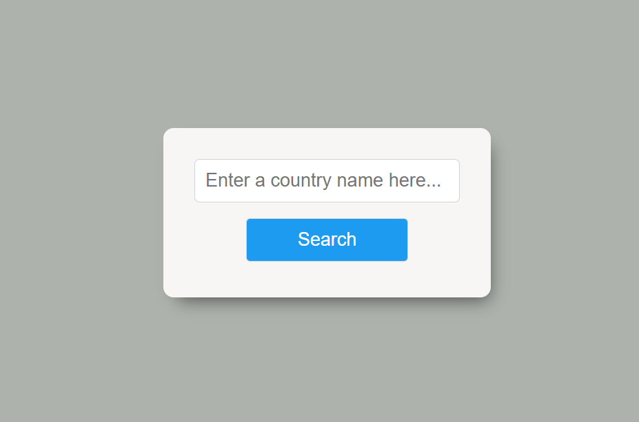
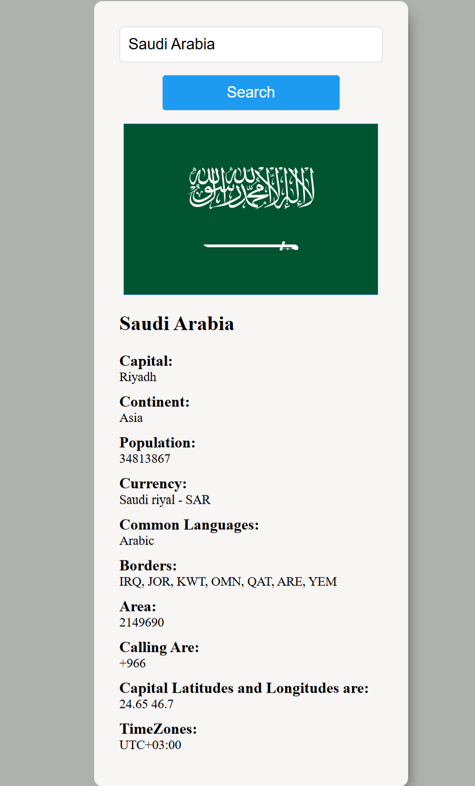

# This is a simple project named Country Information using ReactJS.
# Are you interested in knowing information about all countries? Just type the country name; this app provides basic information about that country.

# Here you type any country name in the text box and enter search button.

# If you type Saudi Arabia, you will see the basic information of it.

